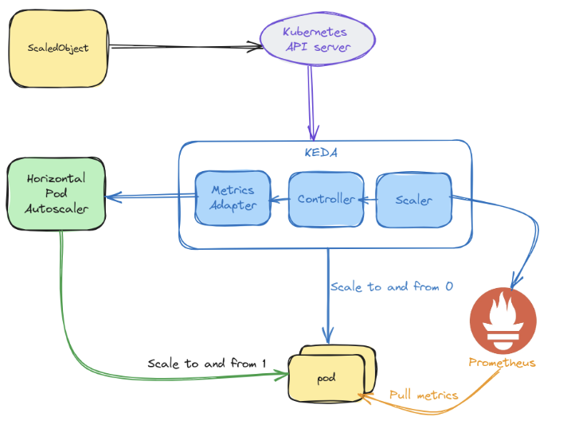

# Despliegue de Kubernetes con Minikube, KEDA y Prometheus

Este proyecto muestra el uso de KEDA para el autoescalado en Kubernetes utilizando Prometheus en Minikube.



## Prerrequisitos

Asegúrate de tener instalados los siguientes requisitos:

- [Minikube](https://minikube.sigs.k8s.io/docs/)
- [kubectl](https://kubernetes.io/docs/tasks/tools/)
- [Helm](https://helm.sh/docs/)
- [Apache Benchmark (ab)](https://httpd.apache.org/docs/2.4/programs/ab.html) o una herramienta similar

## Uso del Makefile

El `Makefile` automatiza la creación y configuración del clúster de Minikube, el despliegue de Nginx y KEDA, y la simulación de tráfico. 

### 1. Crear el clúster de Minikube
```sh
make create-cluster
```
Esto inicia un clúster con los parámetros definidos en el `Makefile`.

### 2. Etiquetar los nodos
```sh
make label-nodes
```
Añade etiquetas y `taints` a los nodos para la afinidad con KEDA.

### 3. Desplegar Nginx
```sh
make deploy-nginx
```
Despliega un servidor Nginx en Kubernetes dentro del namespace definido.

### 4. Instalar KEDA
```sh
make deploy-keda
```
Instala KEDA en un namespace separado y lo configura con afinidad y toleraciones.

### 5. Instalar Prometheus
```sh
make install-prometheus
```
Instala Prometheus para la monitorización de métricas y lo configura con las toleraciones necesarias.

### 6. Aplicar configuración adicional de Prometheus
```sh
make apply-prometheus-config
```
Aplica la configuración de scrape para que Prometheus recolecte métricas de Nginx.

### 7. Crear el ScaledObject
```sh
make create-scaledobject
```
Despliega la configuración de autoescalado para Nginx basada en métricas de Prometheus.

### 8. Simular tráfico
```sh
make simulate-traffic
```
Ejecuta una carga de prueba para activar el autoescalado.

### 9. Despliegue completo
```sh
make deploy
```
Ejecuta todos los pasos anteriores en secuencia para un despliegue completo.

## Comprobaciones manuales

Estos comandos pueden ayudarte a verificar el estado del despliegue:

### Verificar nodos y etiquetas
```sh
kubectl get nodes --show-labels
```

### Verificar pods
```sh
kubectl get pods -A
```

### Verificar el escalado
```sh
kubectl get hpa -n my-app-ns
```

### Acceder a Nginx localmente
```sh
kubectl port-forward service/my-app 8080:80 -n my-app-ns
```
Luego abre en tu navegador: `http://localhost:8080`

### Verificar métricas en el exportador de Prometheus
```sh
kubectl port-forward service/my-app 9113:9113 -n my-app-ns
```
Accede a las métricas en: `http://localhost:9113/metrics`

### Acceder al dashboard de Prometheus
```sh
kubectl port-forward svc/prometheus-server 9090:80 -n monitoring
```
Accede a Prometheus en: `http://localhost:9090`

## Configuración del ScaledObject

El `ScaledObject` es el recurso que KEDA utiliza para definir las reglas de autoescalado. En este caso, el `ScaledObject` está configurado para escalar el despliegue `my-app` en función de las métricas de Prometheus:

```yaml
apiVersion: keda.sh/v1alpha1
kind: ScaledObject
metadata:
  name: my-app-scaler
  namespace: my-app-ns
spec:
  scaleTargetRef:
    name: my-app
  minReplicaCount: 1
  maxReplicaCount: 5
  fallback:
    failureThreshold: 3
    replicas: 1
  advanced:
    restoreToOriginalReplicaCount: true
    horizontalPodAutoscalerConfig:
      behavior:
        scaleDown:
          stabilizationWindowSeconds: 30
          policies:
            - type: Percent
              value: 100
              periodSeconds: 15
  triggers:
    - type: prometheus
      metadata:
        serverAddress: http://prometheus-server.monitoring.svc.cluster.local
        metricName: nginx_http_requests_total
        threshold: "10"
        query: sum(rate(nginx_http_requests_total[1m]))
```

Explicación de los parámetros:
- `scaleTargetRef`: Indica el despliegue (`my-app`) al que se aplicará el escalado.
- `minReplicaCount` y `maxReplicaCount`: Definen el número mínimo y máximo de réplicas.
- `fallback`: Especifica un estado seguro en caso de que KEDA falle (mantiene 1 réplica).
- `advanced`: Configuración avanzada para el comportamiento del escalado.
- `triggers`: Define la métrica para escalar:
  - Tipo: prometheus
  - serverAddress: La dirección del servidor Prometheus
  - metricName: El nombre de la métrica a monitorizar
  - threshold: El umbral que activa el escalado (10 solicitudes por minuto)
  - query: La consulta PromQL para obtener la tasa de solicitudes HTTP

## Estructura del Deployment de Nginx

El despliegue incluye dos contenedores:
1. **nginx**: El servidor web principal
2. **nginx-exporter**: Un contenedor que exporta métricas de Nginx en formato Prometheus

```yaml
apiVersion: apps/v1
kind: Deployment
metadata:
  name: my-app
  namespace: my-app-ns
  labels:
    app.kubernetes.io/name: my-app
    app.kubernetes.io/component: nginx
spec:
  replicas: 1
  selector:
    matchLabels:
      app.kubernetes.io/name: my-app
  template:
    metadata:
      annotations:
        prometheus.io/scrape: 'true'
        prometheus.io/port: '9113'
      labels:
        app.kubernetes.io/name: my-app
        app.kubernetes.io/component: nginx
    spec:
      tolerations:
      - key: "dedicated"
        operator: "Equal"
        value: "prometheus"
        effect: "NoSchedule"
      containers:
        - name: nginx
          image: nginx
          ports:
            - containerPort: 80
          resources:
            limits:
              memory: "128Mi"
              cpu: "50m"
            requests:
              cpu: "25m"
              memory: "64Mi"
        - name: nginx-exporter
          image: nginx/nginx-prometheus-exporter
          resources:
            limits:
              memory: "128Mi"
              cpu: "50m"
            requests:
              cpu: "25m"
              memory: "64Mi"
          ports:
            - containerPort: 9113
```

## Comprobación del autoescalado manual

Para verificar que KEDA está funcionando correctamente y está escalando los pods de Nginx en función de la carga, sigue estos pasos:

1. **Verifica el estado inicial de los pods:**
   ```sh
   kubectl get pods -n my-app-ns
   ```
   Inicialmente, debería haber solo una réplica de Nginx en ejecución.

2. **Verifica que el Exporter de Prometheus está recolectando métricas:**
   ```sh
   kubectl port-forward service/my-app 9113:9113 -n my-app-ns
   ```
   Luego accede a `http://localhost:9113/metrics` y verifica que se están recolectando métricas de Nginx.

3. **Verifica que Prometheus está recibiendo las métricas:**
   ```sh
   kubectl port-forward svc/prometheus-server 9090:80 -n monitoring
   ```
   Accede a `http://localhost:9090` y busca la métrica `nginx_http_requests_total` para comprobar que Prometheus está recibiendo datos.

4. **Genera carga de tráfico para activar el escalado:**
   ```sh
   make simulate-traffic
   ```
   Esto simulará múltiples solicitudes hacia el servicio de Nginx.

5. **Observa cómo KEDA escala los pods:**
   ```sh
   kubectl get hpa -n my-app-ns
   ```
   Esto mostrará la métrica de escalado horizontal, indicando cuántas réplicas se están generando en respuesta a la carga.

6. **Verifica nuevamente los pods en ejecución:**
   ```sh
   kubectl get pods -n my-app-ns
   ```
   Deberías notar que el número de pods ha aumentado en función del tráfico generado.

7. **Detén la carga de tráfico y observa cómo los pods disminuyen:**
   Una vez que se detenga la carga, KEDA reducirá automáticamente el número de pods cuando ya no sean necesarios.
   ```sh
   kubectl get pods -n my-app-ns -w
   ```
   Observa cómo las réplicas disminuyen progresivamente hasta volver al estado inicial.

## Limpiar el entorno

Para eliminar el clúster de Minikube y limpiar los recursos creados, ejecuta:
```sh
make clean
```

## Notas
- Asegúrate de que Minikube tiene suficiente memoria y CPU asignada para manejar la carga.
- KEDA permite escalar basándose en métricas externas, como Prometheus o colas de mensajes.
- La configuración de este proyecto utiliza Prometheus para el escalado basado en la tasa de solicitudes HTTP.
- Puedes modificar los archivos YAML según sea necesario para personalizar el despliegue.

---

¡Listo! Ahora puedes probar KEDA con Minikube y ver el autoescalado en acción utilizando métricas de Prometheus.